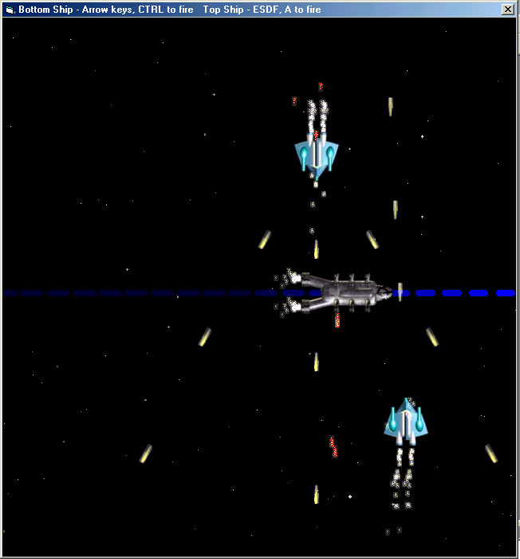



## Space Shoot

### Description

An example of how even with just API calls and some simple math, you can have a lot going on in your game and create some neat effects. Sorry, not much for comments in the code. This example does not incorporate collision detection, but it's a starting point for further development.

By the way, if you press "L" or "K" you can activate/de-activate a triple shot feature for the bottom ship ("B" or "N" for the top ship)
 
### More Info
 

             |
---                |---
**Submitted On**   |2004-08-22 20:36:48
**By**             |[Randy Gomez](https://github.com/Planet-Source-Code/PSCIndex/blob/master/ByAuthor/randy-gomez.md)
**Level**          |Intermediate
**User Rating**    |5.0 (20 globes from 4 users)
**Compatibility**  |VB 6\.0
**Category**       |[Jokes/ Humor](https://github.com/Planet-Source-Code/PSCIndex/blob/master/ByCategory/jokes-humor__1-40.md)
**World**          |[Visual Basic](https://github.com/Planet-Source-Code/PSCIndex/blob/master/ByWorld/visual-basic.md)
**Archive File**   |[Space\_Shoo1784808222004\.zip](https://github.com/Planet-Source-Code/randy-gomez-space-shoot__1-55757/archive/master.zip)

